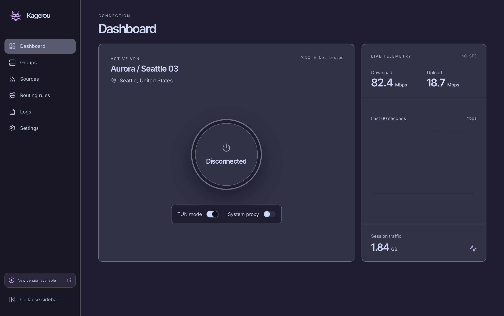

# Kagerou

A cleaner, cross-platform [sing-box](https://sing-box.sagernet.org/) VPN client for desktop, built with [Tauri](https://tauri.app/).

Supports Windows / macOS / Linux.

## Features

- Native desktop app (Tauri + Rust), not an Electron wrapper — small binary, low idle memory.
- TUN mode and system proxy, with per-OS privilege handling: Windows (UAC), macOS (admin prompt), Linux (`CAP_NET_ADMIN` on the binary, falling back to a polkit prompt).
- Profile groups, routing rules, live traffic telemetry, and logs, all driven by sing-box's own Clash-compatible API.
- Catppuccin and Kanagawa themes, English and Russian UI.

## Supported protocols

- VLESS
- VMess
- Trojan
- Shadowsocks
- Hysteria2
- TUIC

## Subscription formats

- A plain or base64-encoded newline list of `vless://` / `vmess://` / `trojan://` / `ss://` / `hysteria2://` (`hy2://` alias) / `tuic://` links
- Clash-style YAML subscriptions (`proxies:`)
- sing-box JSON configs (`outbounds`)

## Installation

No prebuilt releases yet — build it yourself. See [CONTRIBUTING.md](CONTRIBUTING.md) for prerequisites and build steps.

## Credits

- [sing-box](https://github.com/SagerNet/sing-box) — the proxy core Kagerou drives
- [Tauri](https://tauri.app/)
- [shadcn/ui](https://ui.shadcn.com/) and [Radix UI](https://www.radix-ui.com/)
- [Catppuccin](https://catppuccin.com/) and [Kanagawa](https://github.com/rebelot/kanagawa.nvim) color themes

## FAQ

**Does Kagerou need to run as administrator/root?**  
No. Kagerou only asks for elevated privileges when you turn on TUN mode, since creating a TUN interface requires it — on Windows via a UAC prompt, on macOS via the system admin-password prompt, on Linux via a one-time `pkexec` prompt (or none at all, if the sing-box binary already has `CAP_NET_ADMIN` set).

**TUN mode isn't working.**  
Make sure a `sing-box` binary is on your `PATH` (Kagerou doesn't bundle one yet) and that you accepted the elevation prompt. If it still doesn't come up, check the Logs page for what sing-box itself reported.

**Where is my data stored?**  
Profiles, subscriptions, routing rules, and settings live in a local SQLite database under your OS's app-data directory — nothing is synced anywhere.

## Contact

- Open a [GitHub issue](https://github.com/binido/Kagerou/issues).

## License

MIT — see [LICENSE](LICENSE).
